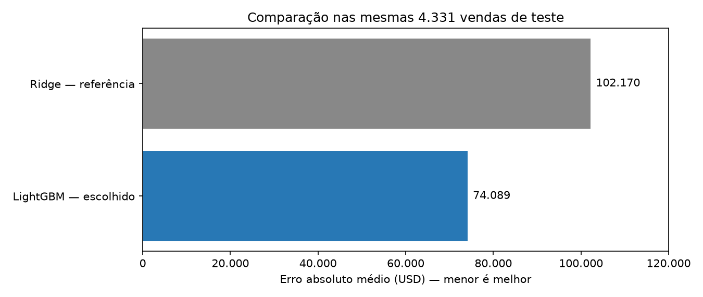
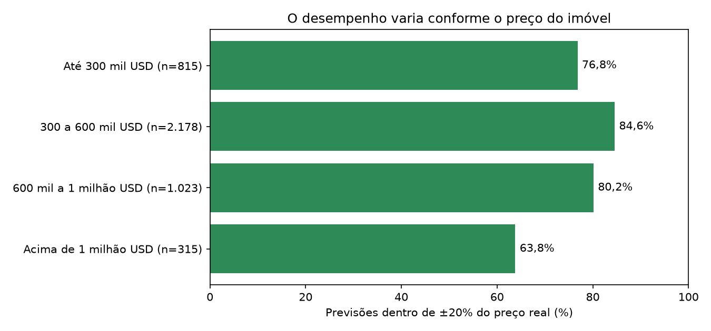

# Comunicação para stakeholders — resultados e decisão de uso

**Moeda adotada:** dólar americano (USD), por premissa do projeto baseada no contexto de Seattle. Não houve conversão cambial nem alteração dos valores. A fonte não confirmou explicitamente a moeda. Preços e erros monetários estão em USD; percentuais, R² e contribuições SHAP em log mantêm suas próprias escalas.

## Objetivo

Apresentar o problema, as evidências obtidas e os limites da solução em linguagem de negócio. Este material usa os resultados já salvos nos notebooks 01 a 06. Não realiza novo treinamento nem altera previsões. API, Docker, MLflow, LLM e deploy são propostas documentadas nos notebooks 07 e 08, não serviços implementados.

**Mensagem principal:** o LightGBM reduziu o erro médio em **27,48%** frente à referência Ridge no mesmo teste, mas ainda apresenta erros importantes e subestimação em imóveis caros. A solução oferece evidências para discutir seu uso como apoio; não há aprovação para precificação automática.

## 1. Problema e público da apresentação

O projeto estima preços de imóveis a partir de características físicas e informações demográficas associadas ao CEP. O público desta apresentação são os responsáveis por decidir como uma estimativa poderia apoiar análise e avaliação de imóveis.

Um uso a discutir seria fornecer uma estimativa inicial acompanhada de revisão humana. Não medimos se isso reduz tempo de trabalho, aumenta receita ou melhora decisões. Esses benefícios precisariam ser avaliados em um piloto adequado, após confirmar as condições de uso e os dados.

**O que temos:** 21.613 vendas históricas, uma tabela demográfica e 100 exemplos sem preço real. As 100 previsões foram entregues em CSV; elas não são a base das métricas de acerto desta apresentação.

## 2. Como chegamos ao modelo

Foram comparados Ridge, Random Forest, XGBoost e LightGBM nas mesmas três janelas de validação temporal. Nos dois melhores candidatos, investigamos grupos de variáveis; depois avaliamos o log do preço e uma busca pequena com Optuna.

O escolhido foi **LightGBM com 50 entradas e transformação logarítmica do preço**. A regra priorizou o MAE e permitiu preferir menos colunas quando a diferença estava até 1% do menor erro observado. A configuração foi congelada antes da avaliação final. Não afirmamos que ele seja o melhor algoritmo em qualquer cenário.

As 50 entradas reúnem 18 características físicas, sete derivadas e 25 indicadores demográficos, sem `hous_val_amt`. As derivadas sozinhas não melhoraram o erro médio dos dois candidatos; o ganho depende da combinação. Não demonstramos que todas as entradas sejam necessárias.

**Por que confiar na comparação, dentro de seus limites:** o treinamento usou 17.191 vendas anteriores ao teste, sem compartilhar IDs de imóveis com as 4.331 vendas reservadas. A preparação aprendeu estatísticas apenas no treino. A EDA anterior examinou o histórico completo; portanto, não descrevemos o teste como totalmente desconhecido durante a exploração. O desempenho observado não garante outros períodos ou regiões.

## 3. Resultado principal: comparar na mesma base

**Leitura do gráfico:** barras menores representam menor erro absoluto médio. Nas mesmas vendas de teste, o MAE passou de **102.170** no Ridge para **74.089** no LightGBM, queda de **27,48%**. A comparação combina algoritmo, entradas e parâmetros; não isola apenas o algoritmo.

**Por que apresentar:** uma referência simples permite avaliar se a solução acrescentou valor preditivo. Essa redução não significa ganho financeiro de 27,48%, nem que o erro seja aceitável para o negócio.

## 4. O que esses erros significam na prática

| Resultado do LightGBM no teste | Tradução para o negócio |
|---|---|
| MAPE de 12,77% | Média dos erros absolutos divididos pelo preço real de cada imóvel; não é percentual de acerto |
| MAE de USD 74.089 | Tamanho médio da diferença entre previsão e preço real; não é um limite máximo por imóvel |
| Erro absoluto mediano de 44.656 | Metade dos erros ficou abaixo ou igual a esse valor |
| Erro percentual mediano de 10,03% | Metade das vendas teve erro percentual até aproximadamente esse valor |
| 49,92% dentro de ±10% | Cerca de 50 em cada 100 previsões de teste ficaram nessa faixa |
| 80,56% dentro de ±20% | Cerca de 81 em cada 100 previsões de teste ficaram nessa faixa |
| Percentil 90 do erro absoluto de 158.094 | Aproximadamente 90% dos erros ficaram até esse valor; os demais foram maiores |
| Viés médio de -45.705 | Houve tendência média de prever abaixo do preço real |

São frequências observadas no teste, não uma probabilidade garantida para a próxima casa. ±10% e ±20% são faixas ilustrativas, não tolerâncias aprovadas. Preços e erros monetários são apresentados em USD, por premissa do projeto.

**Resultado técnico complementar:** RMSE de 129.026 e R² de 0,877. O R² não significa “percentual de acerto”. O detalhamento está no [relatório de avaliação](evaluation_summary.md).

## 5. Onde precisamos de mais cuidado

**Leitura do gráfico:** aqui, barras maiores são melhores. Na faixa de 300 a 600 mil, 84,57% das previsões ficaram dentro de ±20%. Acima de 1 milhão, essa proporção caiu para 63,81%, em 315 vendas. O MAE desse grupo foi aproximadamente 278 mil. Os tamanhos dos grupos estão nos rótulos para evitar comparações sem contexto.

**Por que apresentar:** o erro médio geral esconde diferenças relevantes. O modelo teve mais dificuldade nos imóveis caros, e não apenas em termos absolutos: o erro percentual mediano também foi maior nesse grupo.

**Hipótese para investigação futura:** características raras, informação ausente ou diferenças entre períodos podem contribuir para as falhas. Isso não foi confirmado como causa. As faixas usam o preço real, conhecido retrospectivamente; não são uma regra pronta para identificar automaticamente o risco de uma nova previsão.

## 6. Exemplos concretos: previsão mais próxima, caso central e falha grande

| Caso selecionado | Linha original | Preço real | Preço previsto | Erro percentual |
|---|---:|---:|---:|---:|
| Próximo do percentil 25 do erro percentual | 17612 | 630.000 | 660.236 | 4,80% |
| Próximo da mediana do erro percentual | 13666 | 612.000 | 550.621 | 10,03% |
| Maior erro absoluto | 12370 | 4.208.000 | 2.426.243 | 42,34% |

**Como escolhemos:** o primeiro caso está próximo do percentil 25 do erro percentual; o segundo, da mediana; o terceiro é o maior erro absoluto do teste. A regra evita apresentar só acertos. Os valores de preço estão arredondados para leitura, e os percentuais foram calculados antes do arredondamento. Os registros estão em `reports/metrics/executivo_exemplos.csv`.

Esses três exemplos ilustram situações, mas não substituem as métricas das 4.331 vendas. Não demonstram que um registro com erro alto esteja incorreto ou deva ser removido. Uma explicação do modelo também não prova que sua previsão está correta.

## 7. Quais informações mais influenciaram o modelo?

A importância por permutação mediu quanto o erro aumentou ao embaralhar cada entrada em uma amostra de 600 vendas, com três repetições, sem retreinar.

| Entrada | Leitura acessível | Evidência e limite |
|---|---|---|
| `lat` | Localização por latitude | Maior aumento de erro ao embaralhar nessa amostra; não informa sozinho como todo bairro é valorizado |
| `sqft_living` | Área habitável, conforme interpretação da EDA | O modelo depende dessa informação, mas ela compartilha sinal com outras medidas de área |
| `grade` | Indicador de padrão/qualidade, com definição da fonte pendente | Relevante para prever; não demonstra efeito causal de uma melhoria no imóvel |
| `per_bchlr` e `per_prfsnl` | Indicadores demográficos com significado a confirmar | Influentes no modelo; origem, definição e disponibilidade histórica precisam ser verificadas |

Variáveis correlacionadas e derivadas limitam a interpretação do ranking. SHAP foi usado no notebook 06 para explicar três previsões específicas; suas contribuições estão em log(1 + preço), não em dinheiro. A explicação por LLM permanece uma proposta para traduzir fatos verificados em texto.

## 8. O que está entregue e o que está proposto

| Parte da solução | Situação |
|---|---|
| EDA, merge, features e validação temporal | Implementados e executados |
| Comparação de modelos e avaliação final | Implementadas e executadas |
| Modelo avaliado, relatórios e 100 previsões futuras | Salvos localmente |
| API, pacote de serviço e Docker | Documentados no 07; não implementados |
| Deploy, monitoramento, MLflow e reentreinamento | Documentados no 08; não implantados |
| API externa de LLM para explicações | Documentada; nenhuma chamada realizada |
| Comunicação para stakeholders | Notebook 09 e este resumo executivo |

O fluxo proposto seria: receber características → enriquecer por CEP → criar variáveis → estimar preço com LightGBM → acrescentar explicação, se solicitada e disponível. A LLM não recalcularia o preço. MLflow organizaria experimentos e versões; a release associaria também preparo, demografia e imagem.

Consulte [empacotamento e API](packaging_api.md) e [deploy e operação](deployment.md). Um diagrama de produção é uma proposta de arquitetura, não evidência de um serviço funcionando.

## 9. Limitações e decisão recomendada

**Não declarar o modelo pronto para precificação automática.** Há ganho frente à referência, mas ainda faltam tolerâncias de negócio, confirmação da demografia e avaliação operacional. Isso não invalida o trabalho técnico; delimita o que as evidências sustentam.

O MAE de teste foi **19,02% maior** que a média de validação do 05. O modelo subestima preços em média e tem falhas grandes em determinados segmentos. O conjunto futuro tem sobreposição de características com o histórico e não fornece preços reais para medir acerto.

**Prioridades para continuidade:**

1. Confirmar definições, origem e período dos indicadores demográficos.
2. Acordar o uso pretendido, tolerâncias e necessidade de revisão humana.
3. Se houver uma nova rodada de modelagem, investigar subestimação, correção das previsões e demografia sem derivadas nas janelas de desenvolvimento; melhoria não é garantida.
4. Reservar dados novos para a avaliação independente da versão melhorada, pois o teste atual já foi examinado.
5. Caso a implementação do serviço seja aprovada, seguir as verificações de API, Docker e operação descritas no 07 e 08.

Essas propostas não foram experimentos executados neste notebook. Não estimamos economia, retorno financeiro, latência de API ou custo mensal sem medi-los.

## 10. Roteiro de apresentação — aproximadamente cinco minutos

| Momento | Mensagem sugerida |
|---|---|
| Problema | “Queremos estimar preços com as características disponíveis e entender quando a estimativa falha.” |
| Método | “Comparamos quatro modelos com validação temporal e avaliamos a configuração escolhida em vendas posteriores reservadas.” |
| Resultado | “No teste, o erro médio caiu 27,48% frente ao Ridge. Cerca de 81 em cada 100 previsões ficaram dentro de ±20%.” |
| Limite | “O modelo ainda subestima preços, principalmente nos imóveis caros, e a documentação demográfica precisa ser confirmada.” |
| Decisão | “A entrega demonstra o método e seus limites. Para uso real, precisamos definir tolerâncias e validar as condições operacionais propostas.” |

**Se perguntarem ‘o modelo generaliza?’:** “Temos evidências num período posterior e sem repetição de imóveis entre treino e teste, mas não uma garantia para qualquer região ou momento.”

**Se perguntarem ‘por que o erro ainda é alto?’:** “Há falhas grandes que elevam a média; por isso apresentamos mediana, percentuais e segmentos. A aceitabilidade depende do uso.”

**Se perguntarem ‘já está em produção?’:** “Não. O modelo local foi avaliado; API, Docker, MLflow, LLM e operação foram documentados conforme o escopo acordado.”

## 11. Evidências para consulta

- [Avaliação final e segmentos](evaluation_summary.md).
- [Ficha do modelo](model_card.md).
- [Justificativa da seleção](model_selection_summary.md).
- [100 imóveis com os preços previstos](../reports/predictions/future_unseen_predictions.csv).
- [Comparação numérica no teste](../reports/metrics/avaliacao_metricas.csv).
- [Exemplos desta apresentação](../reports/metrics/executivo_exemplos.csv).

Este material apresenta resultados observados e propostas identificadas, sem novos ajustes ou alegação de aprovação para produção. A publicação do repositório e o envio da entrega não foram realizados nesta etapa.

## Complemento: contextualizando o erro

**Complemento da auditoria — escala do erro e diferença fora do treino**

No teste, o preço médio é **554.588,88** e a mediana é **465.000,00**. O MAE de **74.089,41** equivale a **13,36% do preço médio**. Essa razão ajuda a entender a escala, mas não é MAPE nem significa que cada casa teve esse erro percentual. O erro percentual mediano por imóvel foi **10,03%**. Os valores são apresentados em USD, por premissa do projeto, sem conversão cambial.

Ao reaplicar o modelo salvo às próprias vendas de treino, o MAE foi **41.185,22**. A média de validação foi **62.249,43** e o teste foi **74.089,41**. O desempenho piora fora do treino; não foi demonstrada ausência de overfitting. Mudanças de período e composição dos imóveis também podem contribuir, por isso esses números não identificam sozinhos a causa.

Não há tolerância de negócio aprovada. Melhorar o Ridge não basta para aceitar precificação automática, especialmente com a subestimação dos imóveis caros. O registro das verificações já realizadas está na [auditoria do projeto](project_audit.md).

### MAPE: erro percentual médio como complemento

**Resultado no teste:** LightGBM teve **MAPE de 12,77%**, contra **20,17% do Ridge**, nas mesmas 4.331 vendas. Para cada imóvel, dividimos o erro absoluto pelo preço real, multiplicamos por 100 e depois calculamos a média. Isso expressa o tamanho médio do erro relativo; não significa 87,23% de acerto nem uma garantia para cada previsão.

**Por que incluir:** o MAE de USD 74.089,41 informa a escala monetária; o MAPE facilita comparar erros relativos entre preços diferentes. Ele também é diferente dos **10,03% de erro percentual mediano** e dos **13,36% da razão entre MAE e preço médio**.

**Cuidados e decisão:** o mesmo erro em USD pesa mais em imóveis baratos. Preços próximos de zero podem distorcer o MAPE; no teste, o menor preço é USD 81.000. Mantemos **MAE como critério principal de seleção**. MAPE foi acrescentado às previsões existentes, sem novos treinamentos ou escolha pelo teste; não há tolerância de negócio aprovada.

Na validação do candidato final, a média do MAPE das três janelas é **11,97%**. Agrupando todas as vendas de validação, é **11,92%**: as quantidades de vendas por janela diferem. Para comparar períodos com peso igual, usamos o primeiro valor.

**Leitura por faixa:** o MAPE foi **15,08%** até USD 300 mil; **11,46%** de USD 300 a 600 mil; **12,29%** de USD 600 mil a 1 milhão; e **17,39%** acima de USD 1 milhão. O erro relativo também é maior no grupo mais caro. As faixas são definidas pelo preço real e servem à avaliação retrospectiva, não para classificar automaticamente o risco de uma previsão futura.
