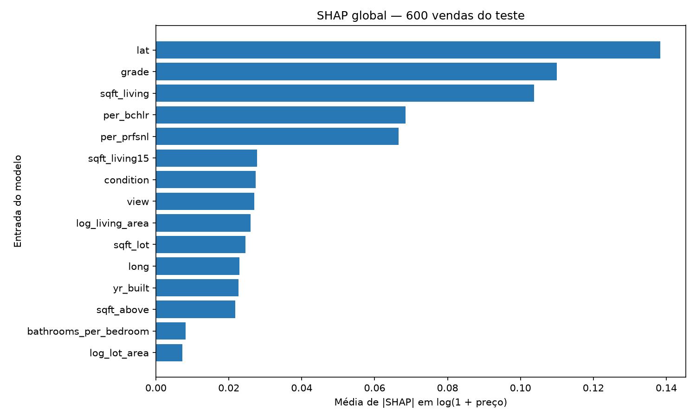
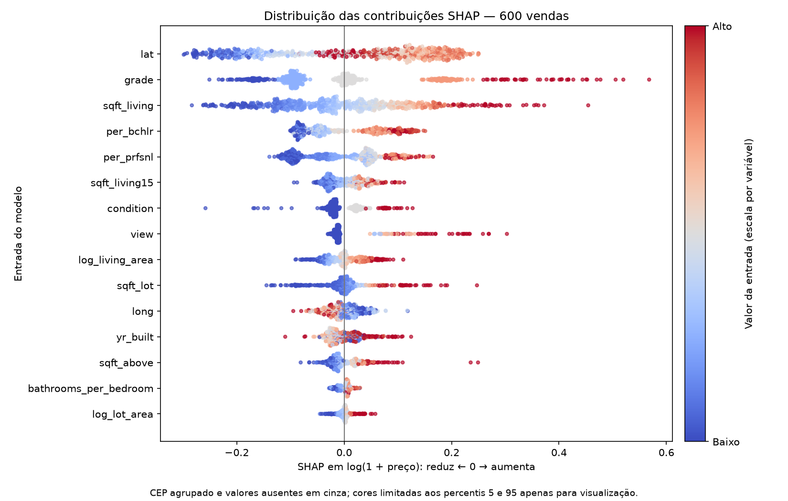

# Explicabilidade com SHAP global

## Método e interpretação

SHAP global foi calculado nas mesmas **600 vendas** usadas na permutação, com o modelo congelado e sem treinamento. O cálculo usa `pred_contrib=True` do LightGBM, que fornece contribuições por entrada transformada e uma coluna de valor base. Os gráficos são produzidos com Matplotlib; não foi instalada a biblioteca `shap`. [Documentação do LightGBM](https://lightgbm.readthedocs.io/en/stable/pythonapi/lightgbm.Booster.html).

**O que o resultado mostra:** nas 600 vendas, `lat` lidera a média de |SHAP| (0,1384), seguida de `grade` (0,1099) e `sqft_living` (0,1037). Depois aparecem `per_bchlr` e `per_prfsnl`. Esses números estão em log(1 + preço): não são dólares, percentuais de importância nem variação causal de preço.

**Por que fazer:** os três casos locais ilustram previsões individuais, mas não mostram a importância média na amostra. As barras resumem a magnitude das contribuições sem deixar sinais positivos e negativos se cancelarem. Por isso, uma barra maior indica maior contribuição média absoluta, não necessariamente aumento de preço.

**Leitura de negócio:** localização, possível padrão construtivo e área habitável têm relação plausível com preços. Os indicadores de escolaridade descrevem contexto regional, com definição e disponibilidade temporal ainda pendentes; não autorizam conclusões sobre moradores ou efeito causal de escolaridade.

**Comparação com permutação:** as mesmas três entradas lideram, mas `grade` e área trocam de posição. Isso é esperado: SHAP resume contribuições na previsão em log; permutação mede aumento do erro em USD após embaralhar uma entrada. Não comparamos diretamente os números dos dois métodos.

**Limites e decisão:** é uma amostra aleatória das mesmas 600 vendas do teste, não uma garantia de representatividade de cada segmento. Dependências entre variáveis afetam a atribuição; não removeremos features nem escolheremos parâmetros com base neste diagnóstico do teste. O CEP é agrupado somando as contribuições de suas colunas one-hot por imóvel antes do cálculo de |SHAP|.

**Como ler o beeswarm:** cada ponto representa uma venda para aquela entrada. À direita de zero, a contribuição eleva a previsão em relação ao valor base; à esquerda, reduz. Azul representa valor baixo da entrada e vermelho, alto, em uma escala própria para cada variável. A dispersão vertical apenas separa pontos próximos e mostra concentração; não é outra medida do imóvel.

**O que aparece nesta amostra:** valores maiores de `sqft_living` e `grade` tendem a se associar a contribuições positivas, enquanto valores menores tendem a contribuições negativas. A latitude também apresenta diferenças marcantes. Isso descreve padrões aprendidos pelo modelo, não um efeito garantido de reformar, aumentar a casa ou mudar de região.

**Por que fazer:** as barras escondem direção e heterogeneidade. O beeswarm permite observar se uma variável contribui de forma semelhante em muitas vendas ou apresenta comportamentos diferentes. Cada ponto mantém seu SHAP completo; somente a escala de cores é limitada aos percentis 5 e 95 para facilitar a leitura.

**Cuidados:** as cores vêm das entradas observadas antes da imputação; ausências são cinza. CEP, quando exibido, também é cinza, pois seus códigos não são uma escala de quantidade. O gráfico mostra as 15 entradas com maior média de |SHAP|; os valores das 50 entradas estão no CSV. As contribuições continuam em log(1 + preço), não USD. Os três exemplos locais permanecem no notebook 06 como complemento.

**Arquivos:** `reports/metrics/avaliacao_shap_global.csv` contém 600 linhas, `source_row`, as 50 contribuições agrupadas e `valor_base_log`. O ranking está em `avaliacao_shap_global_importancias.csv`. As contribuições das colunas one-hot do CEP foram somadas por linha: isso preserva a soma total, mas não equivale a recalcular Shapley com uma única variável categórica como jogador. Somar todas as contribuições com o valor base e aplicar `expm1` reproduz as 600 previsões salvas. A amostra vem de `avaliacao_amostra_importancia.csv`.
